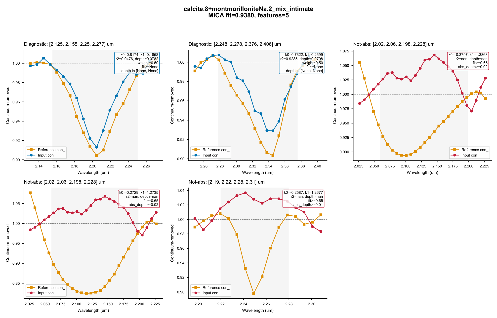
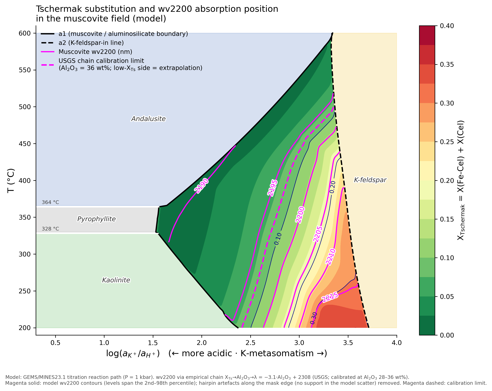

# CRAMM

[](https://pypi.org/project/cramm/)
[](https://pypi.org/project/cramm/)
[](https://github.com/leecugb/cramm/blob/main/LICENSE)
[](https://doi.org/10.5281/zenodo.22024483)


**General-purpose hyperspectral mineral identification toolkit** — built on
the USGS MICA (Material Identification and Characterization Algorithm)
decision-rule system. The classification core is **sensor-agnostic**: it works
on any VNIR–SWIR reflectance cube given its band configuration (center
wavelengths, FWHM, valid-band mask), because the bundled 1 nm rule-face
reference spectra are resampled to the sensor's bands at runtime. EMIT L2A is
simply the built-in data reader — one supported input type, not the defining
one.

CRAMM extends MICA in three ways:

1. **An enhanced rule schema.** CRAMM adds an optional secondary-feature
   depth-ratio constraint (`max_depth_ratio_feat1_over_feat0`) that rejects
   pixels whose secondary absorption is too deep relative to the primary
   2.2 µm feature — suppressing white-mica false positives that pass the
   original five-layer MICA filtering. Nine bundled rules (muscovite, illite,
   kaolinite–muscovite mixtures) carry the new constraint; any custom rule
   can opt in. See *Enhancements over USGS MICA*.
2. **Wavelength-arbitrated muscovite subtyping.** MICA labels a pixel
   "muscovite_lowAl / medAl / medhighAl / Fe-rich" by best fit alone; CRAMM
   then re-arbitrates that attribution with the pixel's fitted 2.2 µm
   absorption center against per-rule calibrated wavelength windows
   (`absorption_center_range`) — the spectroscopically meaningful axis along
   which these four subtypes are actually defined. See *Enhancements over
   USGS MICA → Wavelength-based muscovite attribution*.
3. **From mineral detection to mineral composition.** Beyond labeling
   muscovite pixels, CRAMM fits the per-pixel 2.2 µm absorption-center
   wavelength (`mus_center`) — a quantitative composition proxy whose
   thermodynamic basis (Tschermak substitution vs. wv2200 on a
   GEMS/MINES23.1 reaction-path phase diagram) turns each fitted pixel
   into a calibrated constraint on muscovite chemistry and on its
   position in the T–log(aK⁺/aH⁺) plane. See *Application: reading
   muscovite composition from mus_center*.

Everything is pure Python and GUI-free. Cross-platform:
**Windows / Linux / macOS** · Python **3.9 – 3.13**

---

## Highlights

- **Enhanced MICA pipeline** — continuum removal → closed-form 2×2 least
  squares → fit (r²) & absorption depth → five-layer constraint filtering
  **+ the CRAMM depth-ratio constraint**, driven by a JSON rule library
  (77 rules covering clay, sulfate, carbonate, mica, chlorite, amphibole,
  iron oxide, snow/ice and their mixtures).
- **Quantitative muscovite mapping** — per-pixel 2.2 µm absorption-center
  wavelength as a dedicated thematic map and float array; the same center
  also re-arbitrates the lowAl / medAl / medhighAl / Fe-rich attribution
  against calibrated wavelength windows, with a phase-diagram
  interpretation framework.
- **Quantitative chlorite mapping** — per-pixel 2250 nm absorption-center
  wavelength (`chl_center`) for pixels won by the four pure-chlorite rules,
  as a fourth thematic map and float array; a continuous Fe-content proxy
  anchored by the chl13 calibration (LOO 1.0 nm). The same center also
  re-arbitrates the lowFe / clinochlore / Fe-rich / thuringite attribution
  against calibrated wavelength windows that tile the 2.245–2.266 µm range
  without overlap, so every in-range center arbitrates to exactly one subtype.
- **Quantitative carbonate mapping** — per-pixel 2330 nm absorption-center
  wavelength (`cal_center`) for pixels won by the six carbonate rules,
  as a fifth thematic map and float array; band position tracks the
  seven-anchor C–O sequence (magnesite 2311 nm → rhodochrosite ~2369 nm),
  making species the rule library cannot tell apart (aragonite, magnesite —
  silently classified as dolomite) visible in the continuous layer. The
  same center also arbitrates the dolomite ↔ calcite attribution **within
  each abundance tier** (v1.5.0): the abundant pair and the plain pair
  compete separately against disjoint windows, a 6 nm dead zone shelters
  siderite-ish centers, and the abundance axis never crosses.
- **Whole-scene and single-spectrum modes** — batch-classify an entire scene
  to GeoTIFF, or identify one spectrum (GUI point-click, field
  spectrometer) with Top-N ranking and a PDF diagnostic report.
- **Sensor-agnostic core** — everything downstream of data loading consumes a
  generic `(spectrum, wavelengths, FWHM, valid bands)` contract. The bundled
  reader covers EMIT L2A NetCDF; any other sensor (airborne or spaceborne)
  plugs in through the same seven-tuple — no rule or code changes needed.
- **Fast** — reference-side constants are precompiled once per band
  configuration (two-level cache; ~16× speedup on repeated single-spectrum
  calls), and scene classification parallelizes across rules with worker
  processes.
- **Bit-exact discipline** — serial and parallel paths produce identical
  bytes; every change is guarded by a dual-path golden regression suite.
- **Self-contained** — the rule library (`cramm/data/temp_rf_notfeatures_renamed.json`),
  the 1 nm rule-face spectra bundle (`cramm/data/rf77_splib07_1nm.npz`), and the
  mineral color table are bundled inside the wheel.

## How it works

```
Hyperspectral reflectance cube (any VNIR–SWIR sensor)
      │  built-in: load_emit (EMIT L2A NetCDF, bad-band removal)
      │  or your own loader → (spectrum, wl, w, bp, chanels)
      ▼
Reference resampling ── 1nm rule-face spectra ──► sensor wavelengths/FWHM
      │                                        (Gaussian kernel, cached)
      ▼
Per-rule evaluation (77 rules, parallel across rules)
      │  diagnostic features: continuum removal → 2×2 LSQ → r² / depth
      │  not-absorption / not-related features: exclusion filters
      │  continuum & depth-ratio constraints
      ▼
Best-match selection (argmax weighted fit)  +  muscovite 2.2 µm center fit
      │                                   +  chlorite 2250 nm center fit
      │                                   +  carbonate 2330 nm center fit
      ▼
Wavelength-arbitrated subtyping (muscovite / chlorite / carbonate families)
      │  *_center vs. per-rule absorption_center_range windows
      ▼
Mineral map · color-enhanced map · muscovite map · chlorite map · carbonate map
(+ raw float arrays: mus_center / chl_center / cal_center / fd)
```

## Installation

```bash
pip install cramm            # core features (PyPI wheels on all three platforms)
pip install cramm[tiff]      # + GeoTIFF output (GDAL; PyPI wheels are Windows-only)
pip install cramm[pdf]       # + single-spectrum feature PDF diagnostics
pip install cramm[all]       # everything
```

**GDAL on Linux/macOS**: PyPI ships GDAL wheels for Windows only. Install a
system libgdal first (conda-forge recommended), then install without deps:

```bash
conda install -c conda-forge gdal
pip install cramm --no-deps        # or: pip install cramm[pdf]
```

Without GDAL, only `write_tiff` (GeoTIFF output) is unavailable — all
classification and analysis functions work (lazy import).

From source (sdist / checkout):

```bash
pip install .            # add [all] for the optional extras
```

## Quick start

### Command line

The CLI uses the built-in EMIT L2A reader; for other sensors, use the Python
API (below) with your own loader.

```bash
cramm -i EMIT_L2A_RFL_001_xxx.nc -o output [-n scene] [-w 4] [--raw]
```

| Flag | Default | Meaning |
|---|---|---|
| `-i`, `--input` | *(required)* | Path to the EMIT L2A NetCDF file |
| `-o`, `--output` | `.` | Output directory |
| `-n`, `--name` | input filename | Output filename prefix |
| `-w`, `--workers` | `min(cpu, 8)` | Parallel worker processes (`1` = serial) |
| `--raw` | off | Also save `mus_center` + `chl_center` + `fd` float arrays as `.npz` |

**Output files** (written to `<output>/<name>*`):

| File | Content |
|---|---|
| `<name>_mapping_orth.tiff` | Mineral map (orthorectified, rule-library colors) |
| `<name>_color_enhanced_orth.tiff` | Color-enhanced mineral map |
| `<name>_mus_orth.tiff` | Muscovite 2.2 µm absorption-center thematic map |
| `<name>_chl_orth.tiff` | Chlorite 2250 nm absorption-center thematic map |
| `<name>_cal_orth.tiff` | Carbonate 2330 nm absorption-center thematic map |
| `<name>_raw.npz` | *(only with `--raw`)* `mus_center` + `chl_center` + `cal_center` [μm] + `fd` (fit×depth), float `[r, c]` |

### Python API

```python
from cramm import MicaEngine

engine = MicaEngine()                                    # all resources bundled
spectrum, lon, lat, w, bp, wl, chanels = engine.load_emit("EMIT_xxx.nc")

# --- whole scene → GeoTIFF -------------------------------------------------
orth, color, mus, chl, cal = engine.spectrum_analysis(spectrum, wl, w, bp, chanels,
                                                      n_workers=4)
engine.write_tiff("output/scene", lon, lat, orth, color, mus, chl, cal)

# --- single spectrum (one pixel, field spectrometer, ...) ------------------
pixel = spectrum[100, 200, :]                            # full-band [285] or selected [len(chanels)]
results = engine.classify_spectrum(pixel, wl, w, bp, chanels,
                                   top_n=5, pdf_path="diag.pdf")
for r in results:
    print(f"{r['name']:50s} fit={r['fit']:.4f}  fd={r['fd']:.4f}")
```

### Other sensors (non-EMIT data)

`load_emit` is only a convenience reader. For any other sensor, load the cube
yourself and pass the same band-configuration contract — references are
resampled to your wavelengths/FWHM automatically:

```python
from cramm import MicaEngine
import numpy as np

engine = MicaEngine()
spectrum = my_loader("scene.dat")          # [rows, cols, bands] reflectance
w  = np.array([...])                       # band center wavelengths [µm]
bp = np.array([...])                       # band FWHM [µm]
chanels = np.arange(len(w))                # valid bands (drop bad-band indices)
wl = w[chanels]

orth, color, mus, chl = engine.spectrum_analysis(spectrum, wl, w, bp, chanels,
                                                 n_workers=4)
```

Only the map rendering (`write_tiff`) needs geolocation (`lon`/`lat` grids);
classification itself is purely spectral and location-free.

`classify_spectrum` returns a list of `{"name", "fit", "fd"}` dicts sorted by
descending fit (empty list when nothing passes the filters). With
`pdf_path=` it also writes a multi-page PDF: one page per Top-N mineral with
continuum-removed feature overlays and constraint annotations (requires the
`[pdf]` extra).

Each PDF page dissects one candidate rule — every diagnostic / not-absorption
/ not-relative feature with its continuum endpoints, the reference
continuum-removed profile (squares) against the input (circles), and the
full constraint audit (k0/k1, r², raw depth, weights, thresholds):



More scenarios — float (`raw=True`) output, custom rule libraries, the
`invalidate_caches()` contract, component-level calls — in
[example_usage.py](https://github.com/leecugb/cramm/blob/main/example_usage.py): `python example_usage.py pixel`.

## API overview

| `MicaEngine` method | Purpose |
|---|---|
| `load_emit(path)` | *(EMIT-specific convenience reader)* Read EMIT L2A NetCDF → `(spectrum, lon, lat, w, bp, wl, chanels)`; float32 cube, bad bands removed, fill values zeroed. Not needed for other sensors — supply the same tuple yourself |
| `spectrum_analysis(spectrum, wl, w, bp, chanels, ...)` | Classify a whole scene → 4 uint8 RGB images; `raw=True` adds `mus_center` + `chl_center` + `fd` float arrays. Supports `progress_callback`, `log_callback`, `cancel_flag`, `n_workers` |
| `classify_spectrum(spectrum, wl, w, bp, chanels, top_n=10, pdf_path=None)` | Identify one spectrum → Top-N `[{"name", "fit", "fd"}]` |
| `write_tiff(prefix, lon, lat, orth, color, mus, chl=None)` | Orthorectify (pyresample) and write the GeoTIFFs; `chl` is optional (omit for legacy 3-file output); requires GDAL |
| `get_resample(w, bp)` | All reference spectra resampled to the sensor bands `{rule_name: spectrum}` (cached; keys are rule-name strings — the sole link to the reference library after the v1.4.0 id purge) |
| `invalidate_caches()` | **Required** after mutating `engine.rf` in place — see below |

### Custom rule libraries

```python
engine = MicaEngine(rf_path="my_rules.json")          # at construction
# — or mutate in place —
engine.rf["my_mineral"] = {...}
engine.invalidate_caches()                            # mandatory!
```

The compiled-rule cache is keyed on band configuration only, **not** on rule
content. If you modify `engine.rf` after any classification call, you must call
`invalidate_caches()` (or build a new engine) — otherwise results silently use
the old reference-side constants.

**Schema note (v1.4.0+):** the rule library is id-free. Every
`reference.reflectance_record` (and every `not_(abs/rel)_features[*].reflectance_record`)
must be a rule-name string drawn from the top-level `rf` keys; the loader
verifies this contract at construction and rejects any non-string or
unresolved reference. Custom rules cloning an existing rule set
`reference.reflectance_record` to the source rule's name — the spectrum is
then inherited from the 1 nm bundle row indexed by that name (the clone
itself has no row in the bundle).

**Cache contract (v1.4.1+):** reassigning `engine.rf` to a different dict
object (`engine.rf = new_dict`) is detected automatically via an `id()`
snapshot and the cache is dropped; in-place value mutation
(`engine.rf["x"] = ...`) and in-place key addition (`engine.rf["new"] = ...`)
are **not** detected — the former silently keeps stale results, the latter
raises `KeyError` from the compiled-rules cache (a deliberate stale-trap).
Both require an explicit `invalidate_caches()` call.

### 1 nm rule-face track

The classifier runs the **1 nm rule-face track** exclusively — reference
spectra baked onto a shared 1 nm master grid (350–2500 nm) in
`cramm/data/rf77_splib07_1nm.npz` (77 rule-face rows); no splib06b / specpr / external
library is needed at runtime. The rule library
`cramm/data/temp_rf_notfeatures_renamed.json` carries the **same 77 rules** as the
historical USGS `.mcf` v6a. As of v1.4.0 the rule library is **id-free**:
every `reference.reflectance_record` (and every
`not_(abs/rel)_features` `reflectance_record`) is a rule-name string drawn
from `rf.keys()` — the rule name is the sole link between the rule library
and the 1 nm bundle. Of the 19 rules whose spectra were historically
engine-synthesized from multi-endmember recipes (`mixtures`), 14 are
bit-identical to the legacy library (12 engine-synthesized + 2
weight-1.0 aliases of measured GDS212/213 records) and 5 are weight-1.0 aliases
of splib07's AMX calculated-mixture records (mix_7821/7715/7711/7745/7737);
all 19 now ship as **pre-baked rows** in the npz bundle, so runtime
synthesis is no longer needed and the `mixtures` top-level key has been
removed from the JSON.
The `reference_track` parameter on `MicaEngine` / `MicaClassifier.from_paths`
is kept for API compatibility but ignored; passing anything other than
`None` / `"1nm"` raises `ValueError`.

## Enhancements over USGS MICA

CRAMM extends the original USGS MICA decision rules with an optional per-rule
**secondary-feature depth-ratio constraint**,
`max_depth_ratio_feat1_over_feat0`:

> After the standard MICA filtering, a rule carrying this key rejects any pixel
> where `raw_depth(feat1) / raw_depth(feat0) ≥ threshold`, using the
> *unweighted* feature depths `(1 − min(continuum-removed)) × k0`. Pixels with
> an invalid primary feature (NaN depth) are conservatively kept.

For white micas the primary 2.2 µm Al-OH absorption (feat0) must dominate the
secondary ~2.35 µm feature (feat1); a secondary absorption that is too deep
relative to the primary indicates look-alike minerals rather than muscovite /
illite. Nine bundled rules use this constraint:

| Threshold | Rules |
|---|---|
| `0.6` | muscovite_lowAl, muscovite_medAl, muscovite_medhighAl, muscovite_Fe-rich, illite_imt1, illite_gds4 |
| `0.4` | kaolinite.5+muscoviteMedAl.5, kaolinite.5+muscoviteMedhighAl.5, kaolinite+muscovite_mix_intimate |

The constraint is part of the rule schema — custom rule libraries can set
`"max_depth_ratio_feat1_over_feat0": <float>` on any rule with ≥2 diagnostic
features; omitting the key disables it (original MICA behavior).

### Wavelength-based absorption-center attribution

CRAMM also adds an optional per-feature **absorption-center window**,
`absorption_center_range` on a rule's first diagnostic feature. After the
best-match selection, pixels attributed to a rule carrying this field are
re-arbitrated by their fitted absorption center (`mus_center` at 2.2 µm for
the white-mica family, `chl_center` at 2250 nm for the chlorite family,
`cal_center` at 2330 nm for the carbonate family):

> If the center falls inside exactly one rule's `[lo, hi)` window, differs
> from the current match, and that rule itself accepted the pixel, the pixel
> is reassigned to the matching rule (fit/depth/index follow, and the center
> is refitted once with the new rule's endpoints). An invalid center, a
> center outside every window, or a center inside several overlapping
> windows keeps the original match (conservative).

The four bundled pure-muscovite rules carry calibrated windows (anchored on
each reference spectrum's measured wv2200): medhighAl `[2.195, 2.200)`,
medAl `[2.200, 2.206)`, lowAl `[2.206, 2.210)`, Fe-rich `[2.210, 2.220)` —
the four windows tile the 2.195–2.220 µm range without overlap, so every
valid center arbitrates to exactly one subtype. The four bundled
pure-chlorite rules likewise carry **tiling** windows — lowFe
`[2.245, 2.248)`, clinochlore `[2.248, 2.252)`, Fe-rich `[2.252, 2.256)`,
thuringite `[2.256, 2.266)` — covering the 2.245–2.266 µm range without
overlap, so every in-range `chl_center` also arbitrates deterministically
to exactly one subtype (see *Application: reading chlorite Fe content
from chl_center*). The four calcite/dolomite rules form two abundance
tiers — calcite_abundant vs dolomite_abundant, and calcite vs dolomite —
which since v1.5.0 are arbitrated in **two separate per-tier calls**.
Within each tier the windows are disjoint (dolomite `[2.308, 2.328)` vs
calcite `[2.334, 2.350)`), so an in-window center arbitrates
deterministically to the other mineral of the pair; the two tiers never
mix, locking the abundance axis (abundant vs plain) structurally. A 6 nm
dead zone `[2.328, 2.334)` between the windows conservatively keeps
siderite-ish centers (~2327 nm anchor) on their argmax winner. On the
EMIT test scene this flipped 1599 pixels (0.10 % of the scene)
calcite→dolomite, with zero reverse flips and zero abundant-tier flips
(pinned by a dedicated unit test; see *Application: reading carbonate
species from cal_center*).
This is a scene-classification feature; single-spectrum Top-N ranking is
unaffected. Each arbitration call locks its group to one mineral family
(`MUSCOVITE_MINERALS` / `CHLORITE_MINERALS` — and for carbonates, one
abundance tier per call: `CARBONATE_ABUNDANT_MINERALS` or
`CARBONATE_PLAIN_MINERALS` — ∩ windowed rules), so cross-family and
cross-tier flips are structurally impossible
(pinned by a dedicated unit test). Custom rule libraries opt in per
family: append the new rule to the corresponding family list AND give it
the field; rules without it are never reassigned.

Seven white-mica-group and chlorite rules carry parsed structural formulas
of their reference spectra as bundled metadata:
`reference.structural_formula` with `structural_formula_tier` (`A` =
wet-chemistry Fe³⁺/Fe²⁺ split, `B` = total-Fe convention). White micas
(O=11 anhydrous basis, from the 14-sample white-mica
composition–band-position calibration set): muscovite_medhighAl (GDS113),
muscovite_Fe-rich (GDS116), illite_gds4 (GDS4) and illite_imt1 (IMt-1) —
of the four arbitration windows above, medhighAl and Fe-rich are thereby
anchored to measured chemistry; medAl (CU91-250A) and lowAl (CU93-1) have
no published full analysis. Chlorites (O₁₀(OH)₈ basis, from the chl13
calibration set): chlorite_lowFe (SMR-13), clinochlore (GDS158) and
clinochlore_Fe (SC-CCa-1; chemistry from the Bartel XRF of the same CMS
CCa-1 specimen) — the full lowFe→Fe-rich gradient is chemistry-anchored.
The metadata is informational only and never enters the classification
math.

## Application: reading muscovite composition from mus_center

The muscovite thematic map's per-pixel `mus_center` (2.2 µm Al-OH absorption
position) is a quantitative proxy for muscovite chemistry. The phase diagram
below — a GEMS/MINES23.1 titration reaction-path model of the
K₂O–Al₂O₃–SiO₂–H₂O–HCl–FeO–MgO system — overlays the Tschermak substitution
degree X_Ts = X(Fe-Celadonite)+X(Celadonite) in the muscovite stability field
with the corresponding wv2200 position (USGS conversion chain:
X_Ts → Al₂O₃ wt% → λ = −3.1·Al₂O₃ + 2308):



X_Ts rises from ~0 on the high-T / low-K⁺ side to 0.35+ on the low-T / high-K⁺
side. The wv2200 contours (magenta, 2190→2215 nm) are derived by chaining the
empirical wavelength–composition calibration through the modelled X_Ts field,
so they track the X_Ts contours (dark blue) by construction. Each `mus_center`
value fitted from an image pixel therefore selects one isopleth on this
diagram: muscovite composition (X_Ts) is read directly, while in the
T–log(aK⁺/aH⁺) plane the value defines a one-dimensional constraint locus,
not a unique point. Pinning down both formation temperature and fluid K⁺/H⁺
requires a second independent constraint — e.g. the `chl_center` of a
coexisting chlorite read on the companion diagram, under a same-pressure,
same-fluid equilibrium assumption. The diagram is an interpretive framework
for the product, not a ground-validated inversion.

## Application: reading chlorite Fe content from chl_center

The chlorite thematic map's per-pixel `chl_center` (2250 nm Fe–OH absorption
position) is a continuous composition proxy: across the chl13 calibration
set (13 samples spanning xFe 0.014–0.553) the closed-form model
`pos2250 = 2218.8·xAl + 2279.6·xFe + 2249.7·xMg` reproduces band positions
with LOO-RMSE 1.0 nm — at the repeat-measurement noise floor — and the
calibration is immune to the Fe²⁺/Fe³⁺ reporting convention (closure
normalization cancels it exactly). Like the muscovite subtypes, the four
chlorite rules carry **tiling windows** without overlap: lowFe `[2.245, 2.248)`,
clinochlore `[2.248, 2.252)`, Fe-rich `[2.252, 2.256)`, thuringite
`[2.256, 2.266)` µm. Every in-range `chl_center`
therefore hits exactly one window and arbitrates deterministically to one
subtype, with the center refitted once against the target rule's
endpoints; only an invalid center or one outside every window keeps the
argmax attribution. Practical limits from the
calibration: quantitative inversion needs chlorite ≳50 % of the pixel and a
comparable sample preparation; the 2350 nm Mg–OH band (cross-instrument
anchor, bias ≈0.2 nm) is reserved for pure-mineral checks.

## Application: reading carbonate species from cal_center

The carbonate thematic map's per-pixel `cal_center` (2330 nm C–O absorption
position) discriminates carbonate species along the seven-anchor band
sequence: magnesite 2311 nm < aragonite 2315 nm < Fe-dolomite 2319 nm <
dolomite 2321 nm < siderite ~2327 nm < calcite 2339 nm < rhodochrosite
~2369 nm (Fe²⁺ substitution blue-shifts the band by ~2 nm; Mn²⁺ red-shifts
it). The bundled rule library covers only three of these anchors — calcite
(WS272), dolomite (HS102.3B) and a manganoan siderite (HS271, inherited from
USGS MICA as carbonate_Fe_bearing) — so aragonite and magnesite pixels are
silently classified as dolomite by best fit. `cal_center` makes them
visible: a "dolomite" pixel whose center sits at 2311–2316 nm is a
magnesite/aragonite suspect, and the continuous layer likewise exposes
Fe-bearing dolomite (≤2319 nm) inside the dolomite class. Since v1.5.0 the
wavelength arbitration does reassign carbonate pixels — but only within an
abundance tier: a "calcite" pixel whose center falls in the dolomite window
`[2.308, 2.328)` flips to dolomite (and vice versa within the pair), while
abundant and plain never cross, and the 6 nm dead zone `[2.328, 2.334)`
keeps siderite-ish centers on their argmax winner. On the EMIT test scene
this produced 1599 calcite→dolomite flips (0.10 % of the scene; flipped
centers 2314–2328 nm, i.e. Fe-bearing-dolomite band positions), zero
reverse flips and zero abundant-tier flips. The map bins the
post-arbitration centers at 5 nm steps over [2.308, 2.358) µm, shorter
wavelength = earlier anchor in the sequence above.

## Performance notes

- **Precompiled rules**: continuum endpoints, band indices, the reference-side
  normal-equation constant `B` and depth factors are computed once per
  `(wavelengths, FWHM, valid-band)` configuration and reused across all pixels
  and calls.
- **Parallelism**: scene classification fans out across the 77 rules with
  `multiprocessing` (spawn context). The per-pixel normal-equation solve
  (`k0`/`k1`) is a BLAS-free `np.einsum`, so results are independent of the
  pixel-row count and the BLAS thread pool — the parallel path is bit-identical
  to the serial one structurally, not by BLAS-configuration luck (worker BLAS
  pinning to a single thread is retained as defense in depth).
- **Typical runtime**: a full scene (e.g. an EMIT granule, ≈1280×1242 pixels)
  classifies in about a minute with a few workers on a desktop; a warm
  single-spectrum call is ≈10 ms.

## Testing

```bash
python tests/test_core.py              # 21 API contract / behavior tests
                                       # (integration section auto-skips without the test scene)
python tests/test_custom_rules.py      # custom rule-library verification (7 scenarios:
                                       #   rf_path / constraint & window edits / new rules / cache contract)
python tests/test_parallel_isolation.py # shared-state isolation (6 checks: worker/thread
                                       #   isolation, env restore, temp-file cleanup)

# The suites below need the EMIT test scene in the working directory
# (file name defined in each script's NC constant):
python tests/check_rows_logic.py       # rows alive-pixel semantics (16 checks)
python tests/check_alive_restriction.py # end-to-end A/B: rows-on vs forced-full computation,
                                       #   77 rules + classify + compiled path, bit-level diff
python tests/test_single_spectrum.py   # single-spectrum identification (7 tests:
                                       #   self-ID / noise robustness / determinism / ...)
python tests/check_compiled_path.py    # compiled vs direct path, 302 pixels × 77 rules, bit-level diff
python tests/test_parallel.py 4        # full-scene golden regression (parallel)
python tests/test_parallel.py 1        # full-scene golden regression (serial)
```

**The golden baseline is platform-bound.** `tests/golden_arrays.npz` encodes
this machine's BLAS results; ulp-level differences across BLAS builds are
expected. On a new platform — or after an intentional classification-semantics
change — regenerate the baseline locally with `python tests/rebaseline_golden.py`
(runs the full scene, audits every differing pixel against the intended
change, then atomically rewrites the golden) before relying on
`test_parallel.py`.

## Troubleshooting

- **`netCDF4` fails to open a path containing non-ASCII characters on
  Windows** — a limitation of the netCDF C library, not of CRAMM. `cd` into the
  data directory and use a relative path instead.
- **`ImportError: gdal`** — you called `write_tiff` without GDAL installed; see
  *Installation*. Classification itself never imports GDAL.

## Package layout

```
cramm/
  __init__.py       # exports MicaEngine / ProcessResult
  mica_engine.py    # facade: resource loading + component wiring + CLI main()
  emit_reader.py    # EMIT L2A NetCDF reader + bad-band removal (float32 contract)
  classifier.py     # MICA core: resampling / compiled rules / serial & parallel classification
  renderer.py       # rendering: three maps / GeoTIFF / single-spectrum PDF diagnostics
  data/             # color_table.json + temp_rf_notfeatures_renamed.json + rf77_splib07_1nm.npz
                    # (color table / id-free rule library / 1nm pre-baked spectra)
tests/              # bit-exact verification suite + API contract tests
example_usage.py    # five usage-scenario examples
```

## Requirements

- Python 3.9 – 3.13
- Runtime: `numpy`, `pandas`, `netCDF4`, `pyproj`, `pyresample`, `threadpoolctl`
- Optional: `gdal` (GeoTIFF), `matplotlib` (PDF diagnostics)

## Acknowledgments

The decision rules implement the USGS MICA system
(Kokaly et al., `russet`-era rule set); reference spectra come from the USGS
splib07a spectral library (Clark et al., 2017; 1 nm rule-face grid baked into
`cramm/data/rf77_splib07_1nm.npz`). The bundled test scene uses
EMIT L2A products, courtesy of NASA/JPL.
